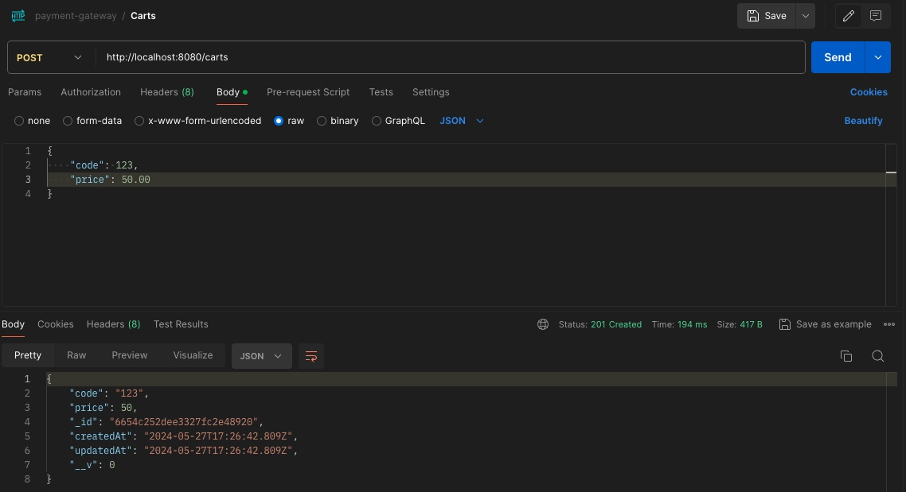
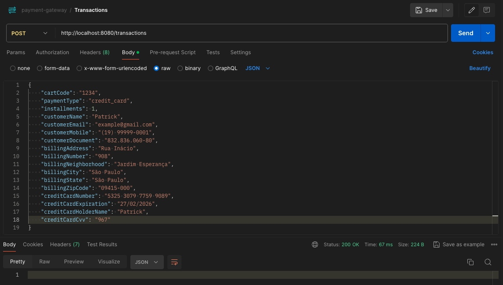
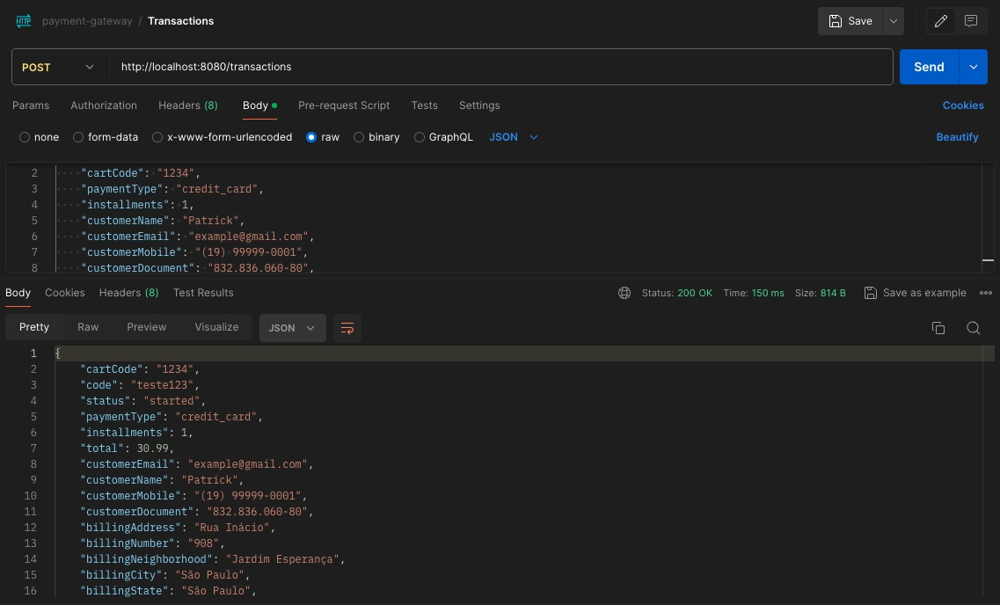

# Gerenciamento de Viagens

## Sobre o Projeto

O projeto consiste no backend de uma aplicação para **Gateway de Pagamento**. A API serve somente para pagamentos com Cartão de Crédito e Boleto (PIX não está implementado).
Não irei colocar imagem de todas as rotas, pois iria ficar muito extenso e algumas rotas possuem dados sensíveis.
Para construção da API, foi necessário utilizar as seguites bibliotecas do Node.js:

- CORS, para garantir a segurança nas rotas do frontend;
- CPF/CNPJ validator, para verificar se o número informado é válido;
- Express para criação de rotas e gerenciamento de requisições HTTP;
- Libphonenumber, para verificar se o número informado é válido no Brasil;
- Uuid para geração de ID;
- Yup para validação do Schema;
- Mongoose como ODM entre Node.js e MongoDB;
- Nodemon para monitorar as mudanças nos arquivos e reiniciar o servidor automaticamente.

Para geração do numero de CPF e Cartões adicionais para teste (além do fornecido pelo PagarMe), eu utilizei o site abaixo que cria cartões e CPF válidos.
- https://www.4devs.com.br/

## Rotas do Projeto

Abaixo estão algumas rotas do projeto. Não irei colocar todas as rotas pois iria ficar muito extenso. Abaixo das imagens está a descrição do que ela representa.

A imagem acima mostra a rota de criação de um item através do número do carrinho.

Nessa outra imagem, temos o registro da transação bem sucedida.

Vemos aqui o registro do retorno da transação com os dados do cliente para processamento do pagamento.

## Tecnologias utilizadas

- Node.js
- JavaScript
- PagarMe
- Postman (Client HTTP)
- MongoDB
